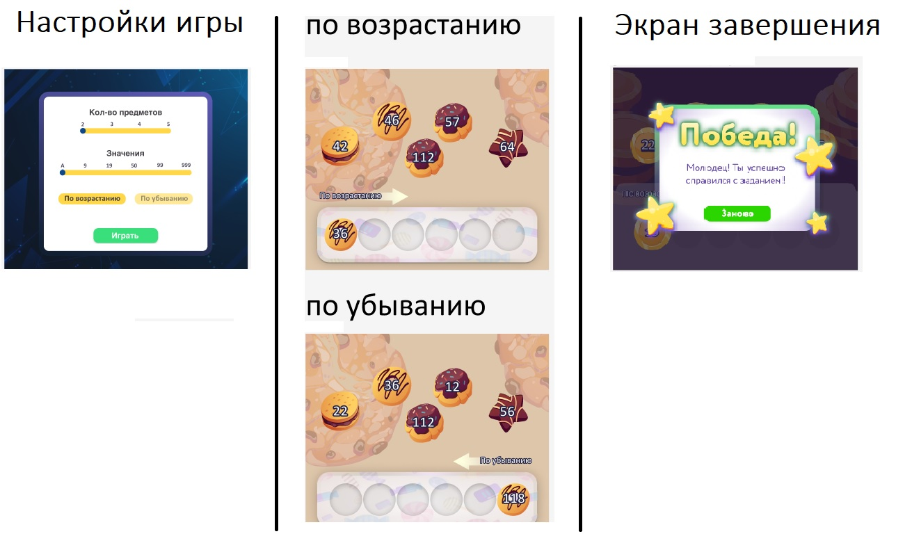

# Educational app "Sorter" for kids
The sorting number or letters is a puzzle games that require a brain. Players will have to place in order or reverse order 2-3-4-5 items. The game is designed to be easy to play.
Have fun and develop!

> The game is suitable for desktop or tablet (layout width 768px).
 
 

## Stack
- NextJS (*yarn create next-app --typescript*)
- React.FC
- TypeScript
- Redux
- SASS
- @emotion/react (yarn add @emotion/react @emotion/styled)
- Normalize.css v8.0.1

## Commits guideline
- type: description ... 
- feat - implemented new functionality from the terms of reference (added zoom support, added a footer, added a product card). 
- fix - bug fixing 
- style - CSS
- refactor - code refactoring 
- test - testName added

*Commit examples:*
> test: create unit test for profile reducer 
> feat: add Header

